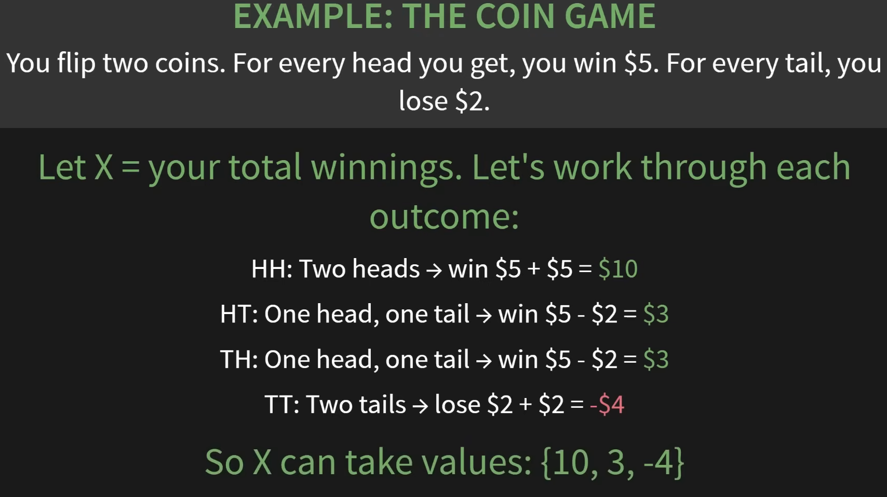
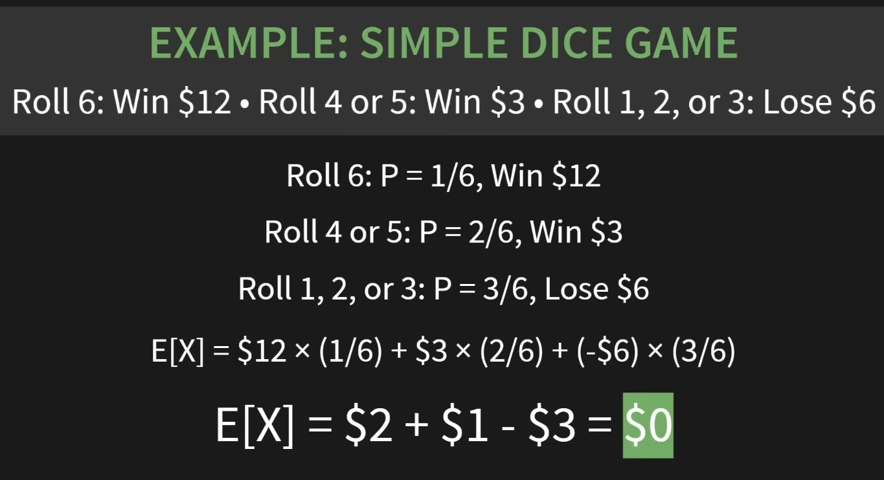

Probability operates on events(sets of outcomes) not individual outcomes.

P(E) = 0.5 Here E is an events which is a set of outcomes. Sometimes a set can have one outcome but 
still is a Event.

How we calculate?
2 thing-
How many outcomes we have in our events? x
How many total outcomes we have in our sample space? y
so P(E) = x/y

3 axioms of probability
1.  Probabilities can't be negative: $P(E) \ge 0$
2.  Something must happen: $P(S) = 1$
3.  If events can't overlap, just add: $P(A \cup B) = P(A) + P(B)$

Pattern in problems:
Identify sample space $\to$ Define events $\to$ Apply the laws

For complicated events:
Complement: $P(A^c) = 1-P(A)$
Intersect: $P(A \cap B) = P(A) \times P(B)$ (For independent events / no conditional probability)
Union: $P(A \cup B) = P(A) + P(B) - P(A \cap B)$
for Disjoint event $P(A \cup B) = P(A) + P(B)$

When we have million or billions of outcomes then we use permutation and combination.

For Permutation and Combination we ask 2 question.
1.  Can we repeat?
2.  Does order matter?

Then we can use 3 formula to calculate:
1.  Repetation allowed: $Outcome = n^k$
2.  No repetation, Order matters: Permutation $P(n,k) = \frac{n!}{(n-k)!}$
3.  No repetation, Order doesn't matters: Combination $C(n,k) = \frac{n!}{k!(n-k)!}$
A decision tree for permutation or combination:

**Conditional Probability:**
Now if we come out from the static world and things start to move the we need conditional probability.
Basically gaining information the probability changes and universe get smaller.

$P(A|B) = \frac{P(A \cap B)}{P(B)}$
Basically out of all the time when B happens how often A also happens. 

Everytime we learn something new, we work in a smaller and mnore focused sample space.

Joint Probability:

**Random Variables:**
<h4>Random variable is just a function that assigns a number to every outcome in our sample space.</h4>

So now we have some number to work with.

**Expected Value:**

Formula: 
Expected Value = Each outcome X Its probability, then add them up
$E[X] = \sum_{i}x_i \cdot P(X=x_i)$

As E[X] = 0 so it is a fair game.